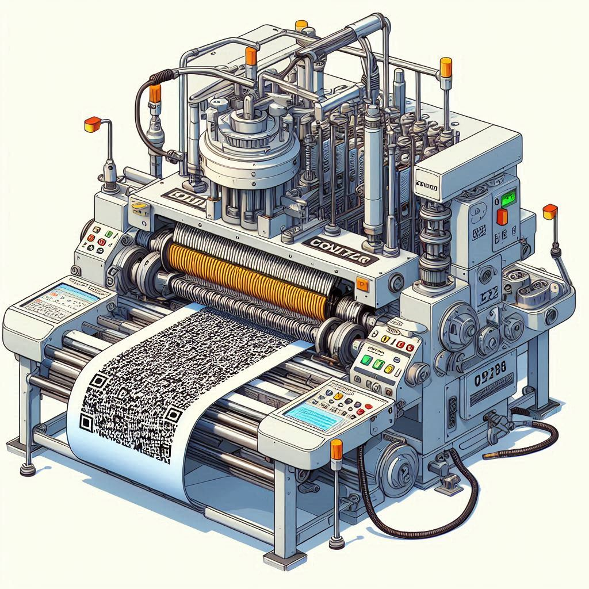

# MRZ Gen API

## Usage

1. install taskfile in your machine
2. create env `python -m venv venv`
3. active the venv for mac/linux `source ./venv/bin/activate` for windows `venv\Scripts\activate`
4. run `task install`
5. run `task dev` for development and `task start` for prod
6. visit `http://localhost:8000/api/v1/docs`
7. have fun :)
